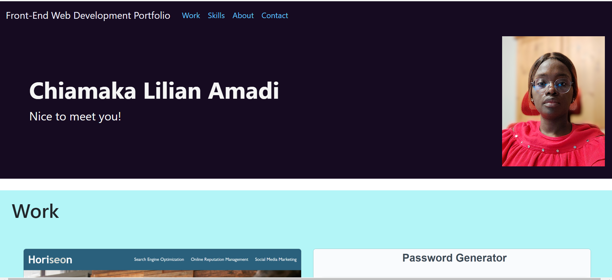

# Portfolio-Bootstrap-

## Description
This challenge was designed to allow the developer build their own professional porfolio using the HTML, Bootstrap and CSS knowledge taught with the aim of developing it to a better version as the program progress.

This helped me understand Bootstrap and how the different properties of CSS are integrated into it. Understanding better the different ways to style a page and make them user-friendly while adherring to the acceptance criteria.

In the course of this challenge i learnt the use of different CSS properties / syntax and the corresponding Bootstrap syntax and Bootstrap Icons. I have also learnt how to locate the different elements on the HTML page while styling using the parent-child method. At first being able to locate each element on the html page was challenging. I have carefully arranged the codes leaving comments where possible to make it understable and easy for it to be modified by anyone.

## Application
* [Portfolio Repository](https://github.com/clamadi/Portfolio-Bootstrap-)
* [Portfolio Webpage](https://clamadi.github.io/Portfolio-Bootstrap-/)

## How to Use
To run this web page, right click on the index.html file and open on a browser of your choice.

The image below gives you a sample of what you will see on the page.

## Mock up

### Resources

* [CSS Property Values](https://www.w3schools.com/cssref/pr_class_display.php#:~:text=Demo%20%E2%9D%AF-,block,takes%20up%20the%20whole%20width)
* [Bootstrap Icons](https://icons.getbootstrap.com/?q=linked)

#### Credit 
The class work, Xpert learning assistant, and activities helped me in completing this mini-project.
